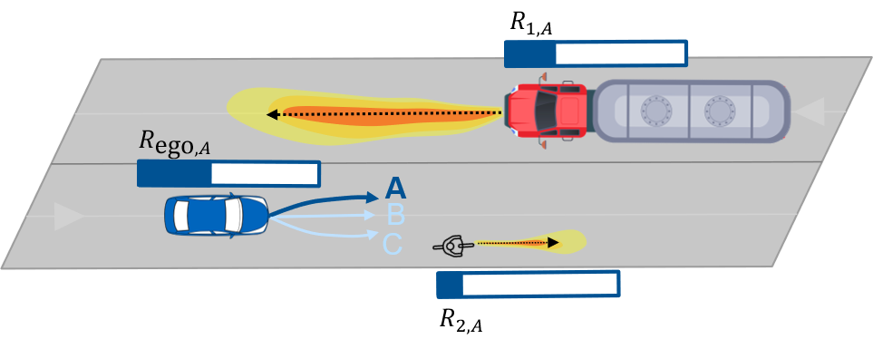
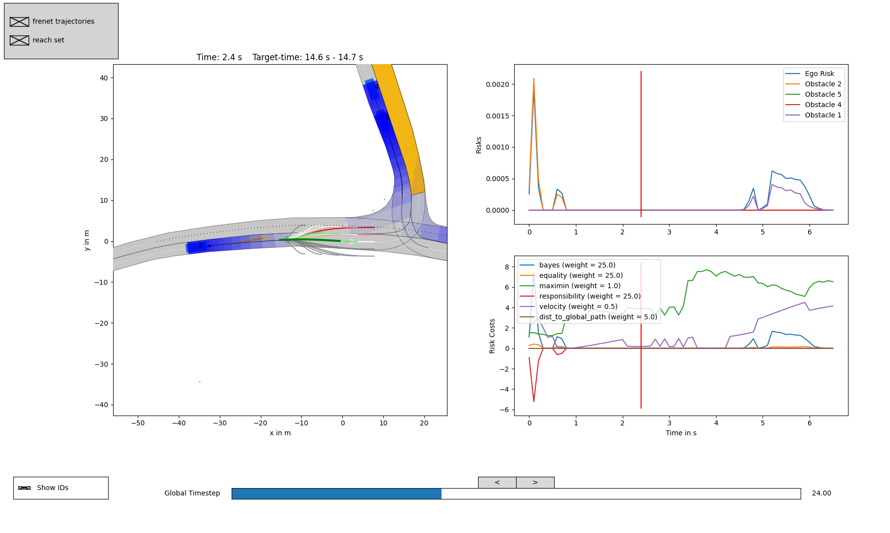

# An Ethical Trajectory Planning Algorithm for Autonomous Vehicles




This repository includes comprehensive ethical trajectory planning software. Its core consists of a quantification of risks in the motion planning of autonomous vehicles and a subsequent fair distribution of risk. The algorithm is compatible to the simulation environment [CommonRoad](https://commonroad.in.tum.de/) and can be evaluated and tested empirically. Further information can be found in the paper (see [References](#references)).

## System Requirements
* Operating System: Linux Ubuntu (tested on 20.04)
* Programming Language: Python >= 3.6 (tested on 3.6 and 3.8)
* [Software Dependencies](/requirements.txt)

## Installation

The installation of this repository takes around 10 min and consists of three steps.
We recommend using an isolated [virtual environment](https://pypi.org/project/virtualenv/) for installation.

1. Clone this repository with:

    `git clone https://github.com/TUMFTM/EthicalTrajectoryPlanning.git`

2. Navigate to the root folder of the repository (`[..]/EthicalTrajectoryPlanning`) and install requirements:

    `pip install -r requirements.txt`

3. Download [CommonRoad scenarios](https://gitlab.lrz.de/tum-cps/commonroad-scenarios) by cloning the scneario repository next to this repository:

    `git clone https://gitlab.lrz.de/tum-cps/commonroad-scenarios`

    so that you have the following folder structure:

    ```
    ├── EthicalTrajectoryPlanning (This repository)
    ├── commonroad-scenarios
    ```

    [Results](#how-to-reproduce-results) were obtained with commonroad-scenarios at commit `35b9cfb5b89d33249ea0d5507b9465650ebeb289`.

## Quick Start Demo

To run the ethical planner on an exemplary default scenario, execute the following command from the root directory of this repository:
    
* `python planner/Frenet/frenet_planner.py`

You will see a live visualization of the scenario being solved by the planner.
Now you can start with your own experiments by changing the [configs](/planner/Frenet/configs/README.md) or selecting another scenario by adding

* `--scenario <path-to-scenario>`

to the command.

By default logs are saved and can be analyzed afterwards by running:

* `python planner/Frenet/analyze_tools/analyze_log.py`


[](/readme/log_analysis.png)


## How to reproduce results

The idea and basic principles of this algorithm are presented in Geisslinger et al. 2022<sup>1</sup>. The following describes how the results from the paper can be reproduced. To evaluate the planning algorithm on multiple scenarios execute:

* `python planner/Frenet/plannertools/evaluatefrenet.py`

By default a single scenario from all available scenarios is randomly chosen. The number of evaluation scenarios can be changed with the `limit_scenarios` variable in the script or by adding `--all` to the command to evaluate on all available scenarios.

To evaluate with the according config settings of [ethical](/planner/Frenet/configs/weights_ethical.json), [ego](/planner/Frenet/configs/weights_ego.json) and [standard](/planner/Frenet/configs/weights_standard.json), add an according argument, for example:

* `python planner/Frenet/plannertools/evaluatefrenet.py --weights ethical --all`

To evaluate on all 2000 scenarios, make sure to have at least 200 GB space left on your device for saving the log files. For better runtime, we recommend using [multiprocessing](/planner/Frenet/plannertools/evaluatefrenet.py#L46) and a [GPU](planner/Frenet/configs/prediction.json#L4) for the prediction network. Evaluating all scenarios in 10 parallel threads with a GPU takes around 48 hours. Results and logfiles for each run are stored in `planner/Frenet/results`.

Standard evaluation metrics such as cummulated harm on all scenarios are provided within the results (e.g. `results/eval/harm.json`). `planner/Frenet/analyze_tools/analyze_risk_dist.py` helps to extract risk values out of multiple logfiles. Boxplots with risk distribtuions as in Geisslinger et al. 2022<sup>1</sup> can be generated using `planner/Frenet/plot_tools/boxplots_risks.py`.


## References

1. Geisslinger, M., Poszler, F., Lienkamp, M. An Ethical Trajectory Planning Algorithm for Autonomous Vehicles *(under review)*

## Contributions
* Maximilian Geisslinger (Main Contributor, [maximilian.geisslinger@tum.de](mailto:maximilian.geisslinger@tum.de?subject=[GitHub]%20Ethical%20Trajectory%20Planning))
* Florian Pfab (Master Thesis: *Motion Planning with Risk Assessment for Automated Vehicles*)
* Simon Sagmeister (Master Thesis: *Neural Networks: Real-time Capable Trajectory Planning through Supervised Learning*)
* Tobias Geissenberger (Bachelor Thesis: *Harm Prediction for Risk-Aware Motion Planning of Automated Vehicles*)
* Clemens Krispler (Bachelor Thesis: *Motion Planning for Autonomous Vehicles: Developing a Principle of Responsibility for Ethical Decision-Making*)
