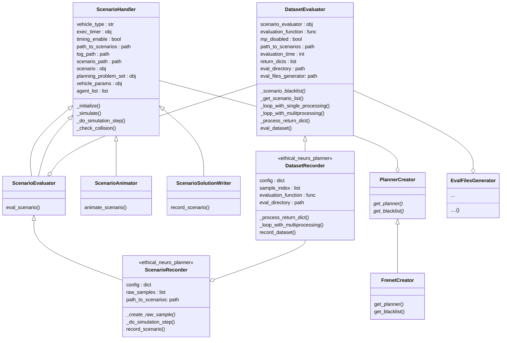

# Class and Inheritance Overview

## In case the diagramm isn't rendered correctly:

This version is rendered by the [Mermaid Live Editor](https://mermaid-js.github.io/mermaid-live-editor/).
But it becomes uneditable.
[![](
https://mermaid.ink/svg/eyJjb2RlIjoiY2xhc3NEaWFncmFtXG4gIGNsYXNzIFNjZW5hcmlvSGFuZGxlcntcblx0dmVoaWNsZV90eXBlIDogc3RyXG5cdGV4ZWNfdGltZXIgOiBvYmpcblx0dGltaW5nX2VuYWJsZSA6IGJvb2xcblx0cGF0aF90b19zY2VuYXJpb3MgOiBwYXRoXG5cdGxvZ19wYXRoIDogcGF0aFxuXHRzY2VuYXJpb19wYXRoIDogcGF0aFxuXHRzY2VuYXJpbyA6IG9ialxuXHRwbGFubmluZ19wcm9ibGVtX3NldCA6IG9ialxuXHR2ZWhpY2xlX3BhcmFtcyA6IG9ialxuXHRhZ2VudF9saXN0IDogbGlzdFxuXHRfaW5pdGlhbGl6ZSgpXG5cdF9zaW11bGF0ZSgpXG5cdF9kb19zaW11bGF0aW9uX3N0ZXAoKVxuXHRfY2hlY2tfY29sbGlzaW9uKClcbiAgfVxuICBcbiAgY2xhc3MgUGxhbm5lckNyZWF0b3J7XG4gIFx0Z2V0X3BsYW5uZXIoKSpcblx0Z2V0X2JsYWNrbGlzdCgpKlxuICB9XG4gIFxuICBjbGFzcyBGcmVuZXRDcmVhdG9ye1xuICBcdGdldF9wbGFubmVyKClcblx0Z2V0X2JsYWNrbGlzdCgpXG4gIH1cbiAgXG4gIGNsYXNzIFNjZW5hcmlvQW5pbWF0b3J7XG4gIFx0YW5pbWF0ZV9zY2VuYXJpbygpXG4gIH1cbiAgXG4gIGNsYXNzIFNjZW5hcmlvU29sdXRpb25Xcml0ZXJ7XG4gIFx0cmVjb3JkX3NjZW5hcmlvKClcbiAgfVxuICBcbiAgY2xhc3MgU2NlbmFyaW9FdmFsdWF0b3J7XG4gIFx0ZXZhbF9zY2VuYXJpbygpXG4gIH1cbiAgXG4gIGNsYXNzIERhdGFzZXRFdmFsdWF0b3J7XG4gIFx0c2NlbmFyaW9fZXZhbHVhdG9yIDogb2JqXG5cdGV2YWx1YXRpb25fZnVuY3Rpb24gOiBmdW5jXG5cdG1wX2Rpc2FibGVkIDogYm9vbFxuXHRwYXRoX3RvX3NjZW5hcmlvcyA6IHBhdGhcblx0ZXZhbHVhdGlvbl90aW1lIDogaW50XG5cdHJldHVybl9kaWN0cyA6IGxpc3Rcblx0ZXZhbF9kaXJlY3RvcnkgOiBwYXRoXG5cdGV2YWxfZmlsZXNfZ2VuZXJhdG9yOiBwYXRoXG5cdF9zY2VuYXJpb19ibGFja2xpc3QoKSpcblx0X2dldF9zY2VuYXJpb19saXN0KClcblx0X2xvb3Bfd2l0aF9zaW5nbGVfcHJvY2Vzc2luZygpXG5cdF9sb3BwX3dpdGhfbXVsaXRwcm9jZXNzaW5nKClcblx0X3Byb2Nlc3NfcmV0dXJuX2RpY3QoKVxuXHRldmFsX2RhdGFzZXQoKVxuICBcbiAgfVxuICBcbiAgXG4gIGNsYXNzIFNjZW5hcmlvUmVjb3JkZXJ7XG4gIFx0PDxtb2RfbmV1cm9fcGxhbm5lcj4-XG4gIFx0Y29uZmlnIDogZGljdFxuXHRyYXdfc2FtcGxlcyA6IGxpc3Rcblx0cGF0aF90b19zY2VuYXJpb3M6IHBhdGhcblx0X2NyZWF0ZV9yYXdfc2FtcGxlKCkqXG5cdF9kb19zaW11bGF0aW9uX3N0ZXAoKVxuXHRyZWNvcmRfc2NlbmFyaW8oKVxuICB9XG4gIFxuXG4gIGNsYXNzIERhdGFzZXRSZWNvcmRlcntcbiAgXHQ8PG1vZF9uZXVyb19wbGFubmVyPj5cbiAgXHRjb25maWcgOiBkaWN0XG5cdHNhbXBsZV9pbmRleCA6IGxpc3Rcblx0ZXZhbHVhdGlvbl9mdW5jdGlvbiA6IGZ1bmNcblx0ZXZhbF9kaXJlY3RvcnkgOiBwYXRoXG5cdF9wcm9jZXNzX3JldHVybl9kaWN0KClcblx0X2xvb3Bfd2l0aF9tdWx0aXByb2Nlc3NpbmcoKVxuXHRyZWNvcmRfZGF0YXNldCgpXG5cdFxuICBcbiAgfVxuXG4gIFxuICBjbGFzcyBFdmFsRmlsZXNHZW5lcmF0b3J7XG4gIC4uLlxuICAuLi4uKClcbiAgfVxuICBcbiAgU2NlbmFyaW9IYW5kbGVyIDx8LS0gU2NlbmFyaW9FdmFsdWF0b3JcbiAgU2NlbmFyaW9IYW5kbGVyIDx8LS0gU2NlbmFyaW9BbmltYXRvclxuICBTY2VuYXJpb0hhbmRsZXIgPHwtLSBTY2VuYXJpb1NvbHV0aW9uV3JpdGVyXG4gIFNjZW5hcmlvSGFuZGxlciA8fC0tIFNjZW5hcmlvRXZhbHVhdG9yXG4gIFNjZW5hcmlvSGFuZGxlciAtLW8gUGxhbm5lckNyZWF0b3JcbiAgUGxhbm5lckNyZWF0b3IgPHwtLSBGcmVuZXRDcmVhdG9yXG4gIERhdGFzZXRFdmFsdWF0b3IgLS1vIFNjZW5hcmlvRXZhbHVhdG9yXG4gIFNjZW5hcmlvRXZhbHVhdG9yIDx8LS0gU2NlbmFyaW9SZWNvcmRlclxuICBEYXRhc2V0RXZhbHVhdG9yIDx8LS0gRGF0YXNldFJlY29yZGVyXG4gIERhdGFzZXRSZWNvcmRlciAtLW8gU2NlbmFyaW9SZWNvcmRlclxuICBEYXRhc2V0RXZhbHVhdG9yIC0tbyBFdmFsRmlsZXNHZW5lcmF0b3IiLCJtZXJtYWlkIjp7fSwidXBkYXRlRWRpdG9yIjpmYWxzZX0 )]